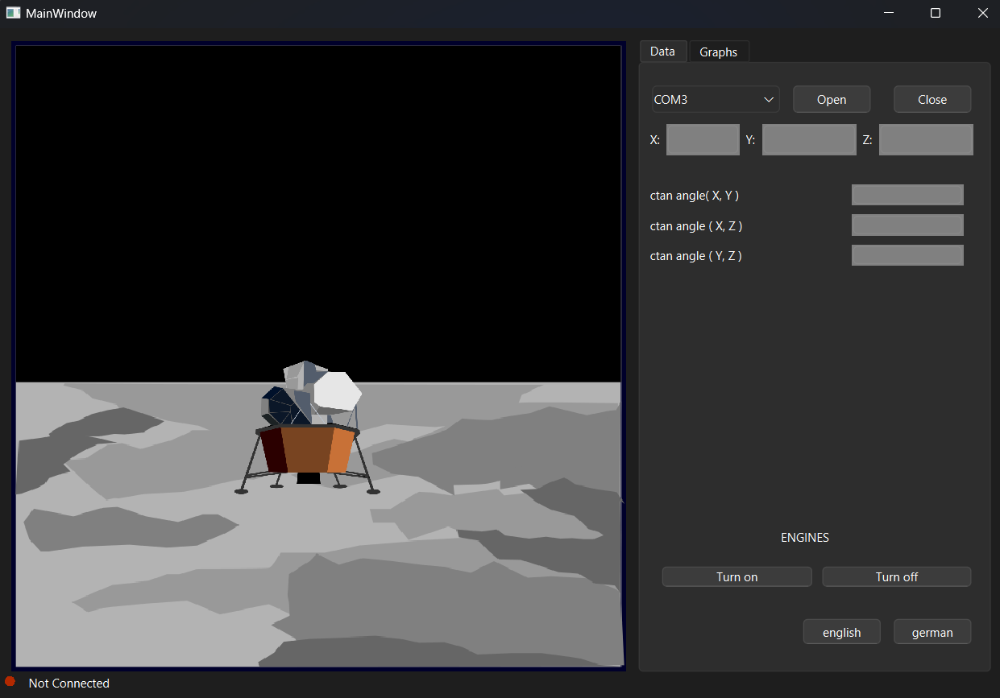
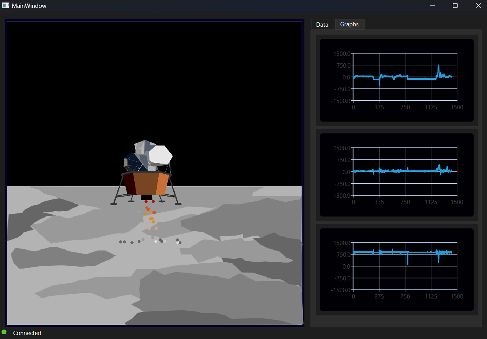

# Qt-Moon-Lander

This project is an interface developed in Qt Creator that visualizes a lander. Its movements are controlled based on real-time data from an accelerometer which is connected to stm32. This microcontroller process data from sensor and send proper information to the Qt application.

